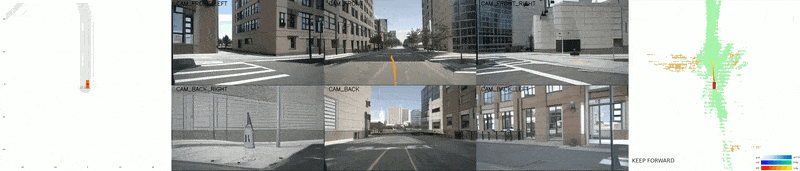
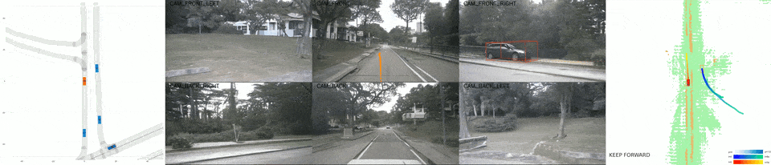
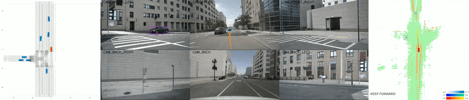

<a id="readme-top"></a>
<!-- PROJECT LOGO -->
<div align="center">
  <!-- <a href=""> -->
  
  <br>
  <a href="https://pjlab-adg.github.io/DriveArena/">
    
  </a>
  <a href="">
    
  </a>
  <hr>
  
  
  
  <br>

  <p align="left">
    This is the official project repository of the paper <b> DriveArena: A Controllable Generative Simulation Platform for Autonomous Driving </b> and is mainly used for releasing schedules, updating instructions, sharing model weights, and handling issues. 
  </p>
</div>

------
### 💡 Notice
DriveArena is currently under active development and will be open sourced soon. 

**If you want to get informed once the code released, please fill out this <a href="https://forms.gle/AYtQdiZEvCTr2T56A">Google form</a>.**

### :new: Updates
`[2024-07-30]:` We've released the project page of DriveArena!  

------

<!-- ABOUT THE PROJECT -->
## :fire: Highlights

<b> DriveArena </b> is a simulation system that can 

* Provide closed-loop high-fidelity testing environments for vision-based driving agents.
* Dynamically control the movement of all vehicles in the scenarios.
* Generate realistic simulation using road networks from any city worldwide.
* Have a modular architecture, allowing the easy replacement of each module.

<div align="center">
  
</div>

The DriveArena is pretrained on nuScenes dataset. All kinds of vision-based driving agents, such as UniAD and VAD, can be combined with <b>DriveArena</b> to evaluate their actual driving performance in the closed-loop realistic simulation environments.

<!-- ROADMAP -->
## 📌 Roadmap

- [x]  Demo Website Release
- [ ]  V1.0 Release
    - [ ]  Traffic Manager Code
    - [ ]  World Dreamer
        - [ ]  Inference Code
        - [ ]  Training Code
        - [ ]  Pretrained Weights
    - [ ]  Evaluation Code
- [ ]  Driving Agent Support
    - [ ]  UniAD
    - [ ]  VAD
    - [ ]  LeapAD
- [ ]  Video AutoRegression Dreamer

<!-- ACKNOWLEDGMENTS -->
## Acknowledgments

Our implementation is based on:
* [LimSim++](https://github.com/PJLab-ADG/LimSim/tree/LimSim_plus)
* [Magicdrive](https://github.com/cure-lab/MagicDrive)
* [UniAD](https://github.com/OpenDriveLab/UniAD)

Thanks for their Awesome open-source work!

<!-- LICENSE -->
## License

Distributed under the [Apache 2.0 license](./LICENSE).

<!-- CONTACT -->
## Citation

If you find our paper and codes useful, please kindly cite us via:

```bibtex

```

<p align="right">(<a href="#readme-top">back to top</a>)</p>
