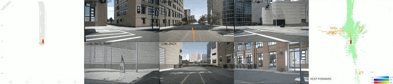
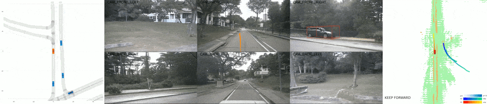
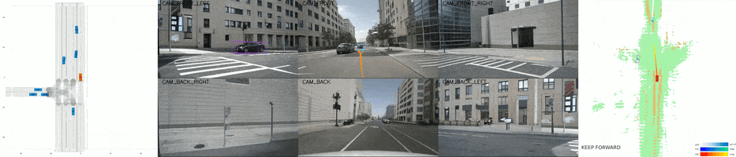
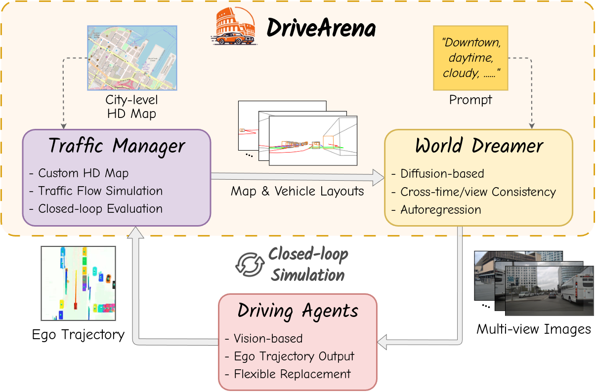

<a id="readme-top"></a>
<!-- PROJECT LOGO -->
<div align="center">
  <!-- <a href=""> -->
  
  <br>
  <a href="https://pjlab-adg.github.io/DriveArena/">
    
  </a>
  <a href="https://arxiv.org/abs/2408.00415">
    
  </a>
  <hr>
  
  
  
  <br>

  <p align="left">
    This is the official project repository of the paper <b> DriveArena: A Controllable Generative Simulation Platform for Autonomous Driving </b> and is mainly used for releasing schedules, updating instructions, sharing model weights, and handling issues. 
  </p>
</div>

<!--
> Xuemeng Yang<sup>1\*</sup>, Licheng Wen<sup>1\*</sup>, Yukai Ma<sup>2,1,\*</sup>, Jianbiao Mei<sup>2,1,\*</sup>, Xin Li<sup>3,5,\*</sup>, Tiantian Wei<sup>1,4,\*</sup>, Wenjie Lei<sup>2</sup>, Daocheng Fu<sup>1</sup>, Pinlong Cai<sup>1</sup>, Min Dou<sup>1</sup>, Botian Shi<sup>1,†</sup>, Liang He<sup>5</sup>, Yong Liu<sup>2,†</sup>, Yu Qiao<sup>1</sup> <br>
> <sup>1</sup> Shanghai Artificial Intelligence Laboratory <sup>2</sup> Zhejiang University <sup>3</sup> Shanghai Jiao Tong University <sup>4</sup> Technical University of Munich <sup>5</sup> East China Normal University <br>
> <sup>\*</sup> Equal Contribution <sup>†</sup> Corresponding Authors
-->

------
### 💡 Notice
DriveArena V1.0 is currently under active development and will be open-sourced soon. 

**If you want to get informed once the code is released, please fill out this <a href="https://forms.gle/AYtQdiZEvCTr2T56A">Google form</a>.**

### :new: Updates

`[2024-08-02]:` The paper can be accessed at [arxiv](https://arxiv.org/abs/2408.00415).

`[2024-07-30]:` We've released the [project page](https://pjlab-adg.github.io/DriveArena/) of DriveArena!  

------

## 🤩 Run DriveArena Demo
**To run the closed-loop / open-loop simulation, please refer to the [documentation](docs/RUN_SIMULATION.md).**

## :fire: Highlights

<b> DriveArena </b> is a simulation platform that can

* Provide closed-loop high-fidelity testing environments for vision-based driving agents.
* Dynamically control the movement of all vehicles in the scenarios.
* Generate realistic simulations with road networks from any city worldwide.
* Follow a modular architecture, allowing the easy replacement of each module.

<div align="center">
  
</div>

The <b>DriveArena</b> is pretrained on nuScenes dataset. All kinds of vision-based driving agents, such as UniAD and VAD, can be combined with <b>DriveArena</b> to evaluate their actual driving performance in closed-loop realistic simulation environments.


## 🏁 Leaderboard of Driving Agents

We provide a leaderboard to present the driving performance evaluation of driving agents with our simulation platform. For the explanation of each evaluation metric, please check out our [paper]( ).

### 1. Open-loop Evaluation Leaderboard

<table>
    <tr style="background-color: #C7C7C7; color: white;">
        <th>Driving Agent</th>
        <th>Simulation Environment</th>
        <th>NC</th>
        <th>DAC</th>
        <th>EP</th>
        <th>TTC</th>
        <th>C</th>
        <th>PDMS</th>
    </tr>
    <tr>
        <td>Human</td>
        <td>Nuscenes GT</td>
        <td>1.000±0.00</td>
        <td>1.000±0.00</td>
        <td>1.000±0.00</td>
        <td>0.979±0.12</td>
        <td>0.752±0.17</td>
        <td>0.950±0.06</td>
    </tr>
    <tr>
        <td>UniAD</td>
        <td>nuScenes original</td>
        <td>0.993±0.03</td>
        <td>0.995±0.01</td>
        <td>0.914±0.05</td>
        <td>0.947±0.14</td>
        <td>0.848±0.21</td>
        <td>0.910±0.09</td>
    </tr>
    <tr>
        <td>UniAD</td>
        <td>DriveArena</td>
        <td>0.792±0.11</td>
        <td>0.942±0.04</td>
        <td>0.738±0.11</td>
        <td>0.771±0.12</td>
        <td>0.749±0.16</td>
        <td>0.636±0.08</td>
    </tr>
</table>

### 2. Closed-loop Evaluation Leaderboard with DriveArena

<table>
    <tr style="background-color: #C7C7C7; color: white;">
        <th>Driving Agent</th>
        <th>Route</th>
        <th>PDMS</th>
        <th>RC</th>
        <th>ADS</th>
    </tr>
    <tr>
        <td>UniAD</td>
        <td>sing_route_1</td>
        <td>0.7615</td>
        <td>0.1684</td>
        <td>0.1684</td>
    </tr>
    <tr>
        <td>UniAD</td>
        <td>sing_route_2</td>
        <td>0.7215</td>
        <td>0.169</td>
        <td>0.0875</td>
    </tr>
    <tr>
        <td>UniAD</td>
        <td>boston_route_1</td>
        <td>0.4952</td>
        <td>0.091</td>
        <td>0.0450</td>
    </tr>
    <tr>
        <td>UniAD</td>
        <td>boston_route_2</td>
        <td>0.6888</td>
        <td>0.121</td>
        <td>0.0835</td>
    </tr>
</table>


<!-- ROADMAP -->
## 📌 Roadmap

- [x]  Demo Website Release
- [ ]  V1.0 Release
    - [ ]  Traffic Manager Code
    - [ ]  World Dreamer
        - [ ]  Inference Code
        - [ ]  Training Code
        - [ ]  Pretrained Weights
    - [ ]  Evaluation Code
- [ ]  Driving Agent Support
    - [ ]  UniAD
    - [ ]  VAD
    - [ ]  LeapAD
- [ ]  Video Autoregression Dreamer

<!-- ACKNOWLEDGMENTS -->
## Acknowledgments

We utilized the following repos during development:

* [LimSim++](https://github.com/PJLab-ADG/LimSim/tree/LimSim_plus)
* [MagicDrive](https://github.com/cure-lab/MagicDrive)
* [UniAD](https://github.com/OpenDriveLab/UniAD)

Thanks for their Awesome open-sourced work!

<!-- LICENSE -->
## License

Distributed under the [Apache 2.0 license](./LICENSE).

<!-- CONTACT -->
## Citation

If you find our paper and codes useful, please kindly cite us via:

```bibtex
@article{yang2024drivearena,
    title={DriveArena: A Closed-loop Generative Simulation Platform for Autonomous Driving}, 
    author={Xuemeng Yang and Licheng Wen and Yukai Ma and Jianbiao Mei and Xin Li and Tiantian Wei and Wenjie Lei and Daocheng Fu and Pinlong Cai and Min Dou and Botian Shi and Liang He and Yong Liu and Yu Qiao},
    journal={arXiv preprint arXiv:2408.00415},
    year={2024}
}
```

<p align="right">(<a href="#readme-top">back to top</a>)</p>
