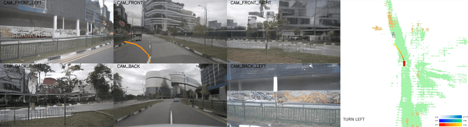

<a id="readme-top"></a>

<!-- PROJECT LOGO -->
<div align="center">
  
  
  <p>
    <a href="https://pjlab-adg.github.io/DriveArena/">
      
    </a>
    <a href="https://arxiv.org/abs/2408.00415">
      
    </a>
    <a href="https://groups.google.com/g/drivearena">
      
    </a>
  </p>
    <b>[<a href="docs/RUN_SIMULATION.md">Documentation</a> | <a href="docs/RUN_SIMULATION_CN.md">中文说明</a>]</b>
  <hr>
  
  
  
	

  <br>

  <p align="left">
    This is the official project repository of the paper <b>DriveArena: A Controllable Generative Simulation Platform for Autonomous Driving</b> and is mainly used for releasing schedules, updating instructions, sharing model weights, and handling issues. 
  </p>
</div>
<!--
> Xuemeng Yang<sup>1\*</sup>, Licheng Wen<sup>1\*</sup>, Yukai Ma<sup>2,1,\*</sup>, Jianbiao Mei<sup>2,1,\*</sup>, Xin Li<sup>3,5,\*</sup>, Tiantian Wei<sup>1,4,\*</sup>, Wenjie Lei<sup>2</sup>, Daocheng Fu<sup>1</sup>, Pinlong Cai<sup>1</sup>, Min Dou<sup>1</sup>, Botian Shi<sup>1,†</sup>, Liang He<sup>5</sup>, Yong Liu<sup>2,†</sup>, Yu Qiao<sup>1</sup> <br>
> <sup>1</sup> Shanghai Artificial Intelligence Laboratory <sup>2</sup> Zhejiang University <sup>3</sup> Shanghai Jiao Tong University <sup>4</sup> Technical University of Munich <sup>5</sup> East China Normal University <br>
> <sup>\*</sup> Equal Contribution <sup>†</sup> Corresponding Authors
-->

---

### 🆕 Updates

- **`2024-11-07:`** **WorldDreamer V1.1** and the **pretrained weight trained on nuScenes and nuPlan** is released! We now support training and inference on **`nuScenes`** and **`nuPlan`** datasets.

- **`2024-09-05:` 🎉🎉We are thrilled to announce the release of DriveArena V1.0! 🎉🎉**

  Join our [Google group](https://groups.google.com/g/drivearena) for the latest news and discussions.

- **`2024-08-02:`** The paper is now available on [arXiv](https://arxiv.org/abs/2408.00415).

- **`2024-07-30:`** We've launched the [official project page](https://pjlab-adg.github.io/DriveArena/) for DriveArena!

---


## Table of Contents:
- [Table of Contents:](#table-of-contents)
- [🤩 Running DriveArena](#-running-drivearena)
- [:fire: Highlights](#fire-highlights)
- [🏁 Leaderboard of Driving Agents](#-leaderboard-of-driving-agents)
  - [1. Open-loop Evaluation Leaderboard](#1-open-loop-evaluation-leaderboard)
  - [2. Closed-loop Evaluation Leaderboard](#2-closed-loop-evaluation-leaderboard)
- [📌 Roadmap](#-roadmap)
- [🔍 Video Autoregression Dreamer (Coming Soon)](#-video-autoregression-dreamer-coming-soon)
- [Acknowledgments](#acknowledgments)
- [📝 License](#-license)
- [🔖 Citation](#-citation)


## 🤩 Running DriveArena
**To run the closed-loop / open-loop simulation, please refer to the [[Documentation](docs/RUN_SIMULATION.md)|[中文说明](docs/RUN_SIMULATION_CN.md)].**

Just for three steps, and you will be able to launch DriveArena as the window below:


<div align="center">
  
</div>

## :fire: Highlights

<b> DriveArena </b> is a simulation platform that can

* Provide closed-loop high-fidelity testing environments for vision-based driving agents.
* Dynamically control the movement of all vehicles in the scenarios.
* Generate realistic simulations with road networks from any city worldwide.
* Follow a modular architecture, allowing the easy replacement of each module.

<div align="center">
  
</div>

The <b>DriveArena</b> is pretrained on nuScenes dataset. All kinds of vision-based driving agents, such as UniAD and VAD, can be combined with <b>DriveArena</b> to evaluate their actual driving performance in closed-loop realistic simulation environments.


## 🏁 Leaderboard of Driving Agents

We provide a leaderboard to present the driving performance evaluation of driving agents with our simulation platform. For the explanation of each evaluation metric, please check out our [paper]( ).

### 1. Open-loop Evaluation Leaderboard

<table>
    <tr style="background-color: #C7C7C7; color: white;">
        <th>Driving Agent</th>
        <th>Simulation Environment</th>
        <th>NC</th>
        <th>DAC</th>
        <th>EP</th>
        <th>TTC</th>
        <th>C</th>
        <th>PDMS</th>
    </tr>
    <tr>
        <td>Human</td>
        <td>Nuscenes GT</td>
        <td>1.000±0.00</td>
        <td>1.000±0.00</td>
        <td>1.000±0.00</td>
        <td>0.979±0.12</td>
        <td>0.752±0.17</td>
        <td>0.950±0.06</td>
    </tr>
    <tr>
        <td>UniAD</td>
        <td>nuScenes original</td>
        <td>0.993±0.03</td>
        <td>0.995±0.01</td>
        <td>0.914±0.05</td>
        <td>0.947±0.14</td>
        <td>0.848±0.21</td>
        <td>0.910±0.09</td>
    </tr>
    <tr>
        <td>UniAD</td>
        <td>DriveArena</td>
        <td>0.792±0.11</td>
        <td>0.942±0.04</td>
        <td>0.738±0.11</td>
        <td>0.771±0.12</td>
        <td>0.749±0.16</td>
        <td>0.636±0.08</td>
    </tr>
</table>

### 2. Closed-loop Evaluation Leaderboard

<table>
    <tr style="background-color: #C7C7C7; color: white;">
        <th>Driving Agent</th>
        <th>Route</th>
        <th>PDMS</th>
        <th>RC</th>
        <th>ADS</th>
    </tr>
    <tr>
        <td>UniAD</td>
        <td>sing_route_1</td>
        <td>0.7615</td>
        <td>0.1684</td>
        <td>0.1684</td>
    </tr>
    <tr>
        <td>UniAD</td>
        <td>sing_route_2</td>
        <td>0.7215</td>
        <td>0.169</td>
        <td>0.0875</td>
    </tr>
    <tr>
        <td>UniAD</td>
        <td>boston_route_1</td>
        <td>0.4952</td>
        <td>0.091</td>
        <td>0.0450</td>
    </tr>
    <tr>
        <td>UniAD</td>
        <td>boston_route_2</td>
        <td>0.6888</td>
        <td>0.121</td>
        <td>0.0835</td>
    </tr>
</table>


<!-- ROADMAP -->
## 📌 Roadmap

- [x]  Demo Website Release
- [x]  V1.0 Release
    - [x]  Traffic Manager Code
    - [x]  World Dreamer
        - [x]  Inference Code
        - [x]  Training Code
        - [x]  Pretrained Weights
    - [x]  Driving Agent Support
      - [x]  UniAD
- [x]  V1.1 Release
    - [x] WorldDreamer
        - [x]  Code for nuPlan
        - [x]  Pretrained Model trained on nuScenes + nuPlan
- [ ]  Evaluation Code
- [ ] Development Tutorial
- [ ]  Driving Agent Support
    - [ ]  VAD
    - [ ]  LeapAD
- [ ]  Video Autoregression Dreamer

## 🔍 Video Autoregression Dreamer (Coming Soon)
**Video Autoregression Dreamer Capable of Producing Videos Exceeding 220 Frames**
  
  
**UniAD Performance**

  
  


<!-- ACKNOWLEDGMENTS -->
## Acknowledgments

We utilized the following repos during development:

* [LimSim (Ours!)](https://github.com/PJLab-ADG/LimSim/tree/LimSim_plus)
* [MagicDrive](https://github.com/cure-lab/MagicDrive)
* [UniAD](https://github.com/OpenDriveLab/UniAD)

Thanks for their Awesome open-sourced work!

<!-- LICENSE -->
## 📝 License

Distributed under the [Apache 2.0 license](./LICENSE).

<!-- CONTACT -->
## 🔖 Citation

If you find our paper and codes useful, please kindly cite us via:

```bibtex
@article{yang2024drivearena,
    title={DriveArena: A Closed-loop Generative Simulation Platform for Autonomous Driving}, 
    author={Xuemeng Yang and Licheng Wen and Yukai Ma and Jianbiao Mei and Xin Li and Tiantian Wei and Wenjie Lei and Daocheng Fu and Pinlong Cai and Min Dou and Botian Shi and Liang He and Yong Liu and Yu Qiao},
    journal={arXiv preprint arXiv:2408.00415},
    year={2024}
}
```

<p align="right">(<a href="#readme-top">back to top</a>)</p>
