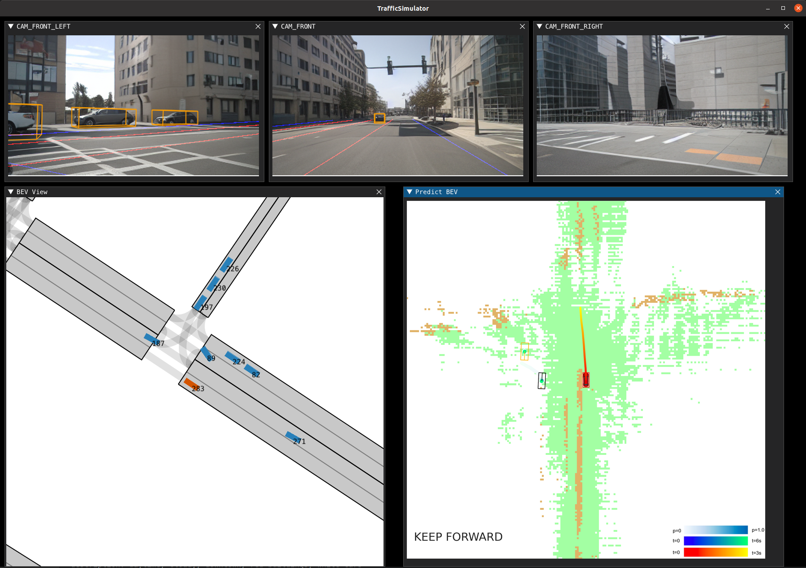

## TrafficManager Quickstart
---
#### 💡 Please run the following code on a local machine with a display.

**1.	Install Python dependencies:**

```bash
cd TrafficManager
conda create --name drivearena_tf python=3.8
conda activate drivearena_tf
pip install -r requirements.txt
```

After completing the setup, you can perform an initial verification:


```bash
cd ../ # under DriveArena root folder
python ./TrafficManager/sim_manager_only.py
``` 

If the program runs correctly and the GUI displays properly, proceed to the next step.

**2. Deploy [World Dreamer](../../WorldDreamer/docs/GETTING_STARTED.md) and [Driving Agent](../../DrivingAgents/UniAD/README.md) Services on the remote Server or Locally**
<!-- Detailed instructions: <span style="color: red;">此处需要link到相关文档</span> -->

**3. Port Mapping**

💡 If WorldDreamer and Driving Agent are running locally or can be accessed directly via the public internet, you can skip this step.

Map the server-side service ports to your local machine:

```bash
# Assume you can connect to server as: ssh username@server_adress -p server_port
ssh -N username@server_adress -p server_port -L 11000:localhost:server_diffusion_port -L 11001:localhost:server_driver_port
```

Please keep this terminal window open.

**4. Configuration Settings**

Confirm that the IP and port settings are correct in the [config.yaml](../../config.yaml) file:
```yaml
servers:
    diffusion: "http://127.0.0.1:11000/"
    driver: "http://127.0.0.1:11001/"
```

**5. Run the Program**
```bash
# under DriveArena root folder
python ./TrafficManager/sim_manager.py
``` 
The program should display the following interface:



The program will stop either after the ego_agent completes the assigned route or if a collision occurs. You can also manually terminate the program at any time.

**6. View Results**
The result files from each run are saved in subfolders within the `DriveArena/results/` directory, named according to the run time in the format `mm-dd-hhmmss`.

* Calculate the Driving Score:
    ```bash
    python ./TrafficManager/score_calculator.py ./results/mm-dd-hhmmss/ # modify to real path
    ```

* Create a Video:
    The `imgs/` subfolder inside the results folder contains images of each frame, including WorldDreamer outputs, GT BEV, and Agent-predicted BEV. Use the following script to make a video from these images:

    ```bash
    python ./TrafficManager/generate_video.py --output_dir   ./results/mm-dd-hhmmss/ # modify to real path
    ```

    A file named output_video.mp4 will be generated in the mm-dd-hhmmss folder.

    