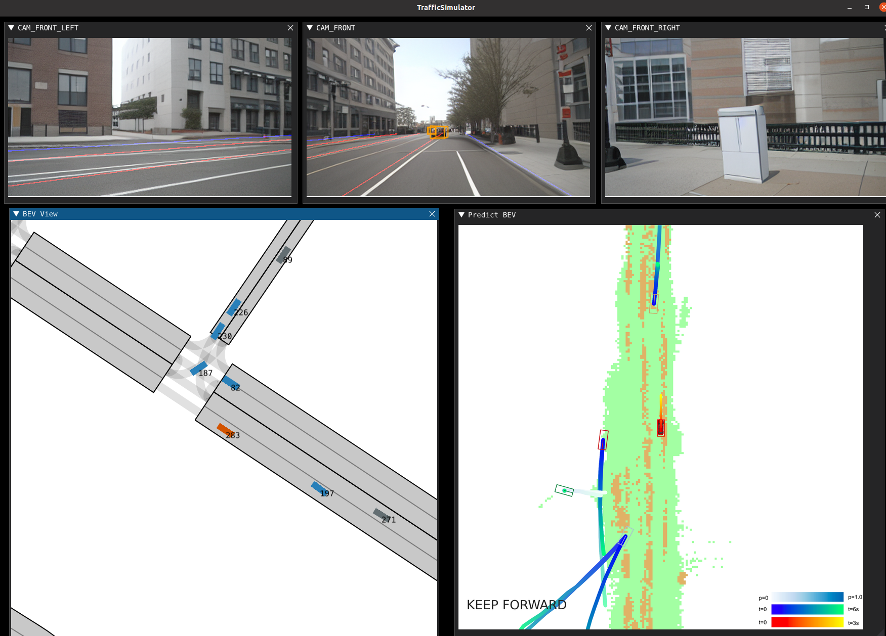

#  🤩 Run DriveArena Demo!

The communication between TrafficManager, WorldDreamer and DrivingAgent is based on **FastAPI**. 

⚠️⚠️**WorldDreamer** and **DrivingAgent** can be run on the **remote server**, while **TrafficManager** needs to be run on **a local machine with a screen**.

## Step 1: Launch WorldDreamer Service
Please follow the [README.md](../WorldDreamer/README.md) to prepare the environment and download the weights.

Then you can run the following code.
```shell
cd WorldDreamer && python tools/dreamer_fast_api.py --resume=path/to/your/weight
```

## Step 2: Launch DrivingAgent Service

### UniAD
Please follow the [README.md](../DrivingAgents/UniAD/README.md) to prepare the environment and download the weights.

```shell
cd DrivingAgents/UniAD && python demo/fast_api_uniad.py
```

### VAD
Please follow the [README.md](../DrivingAgents/VAD/README.md) to prepare the environment and download the weights.

```shell
cd DrivingAgents/VAD && python demo/fast_api_vad.py
```

## Step 3: Launch TrafficManager and Start Simulation
Please follow the [README.md](../TrafficManager/README.md) to start the simulation.

If everything is all right, you can see a window like this!

